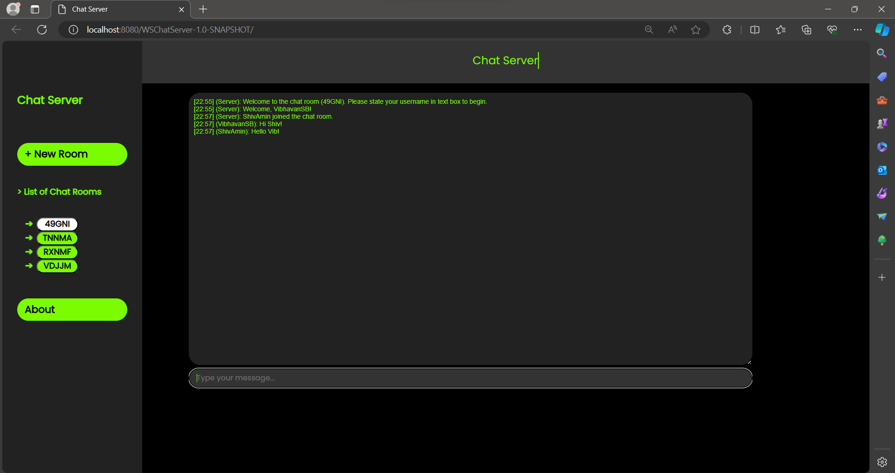
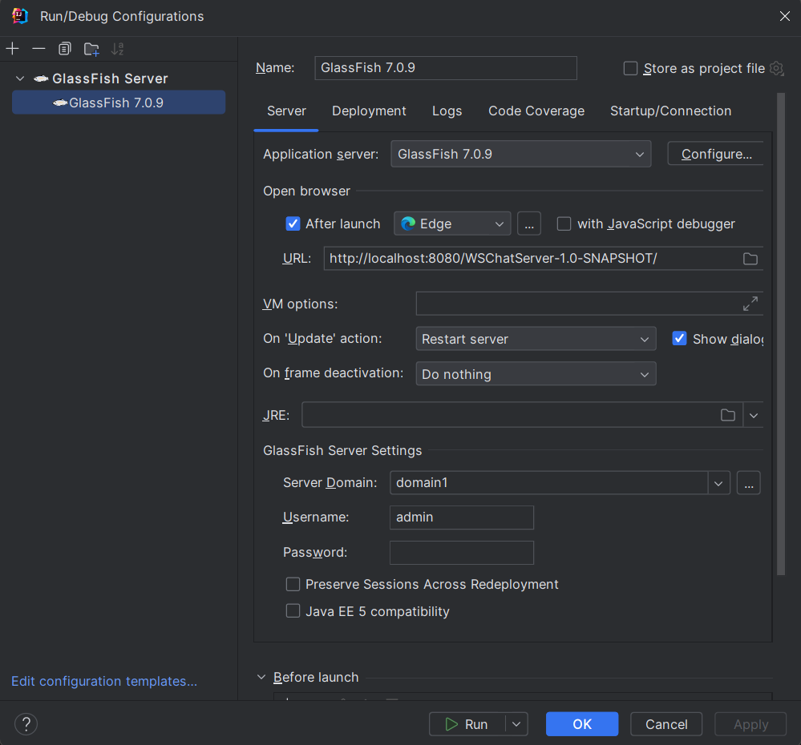
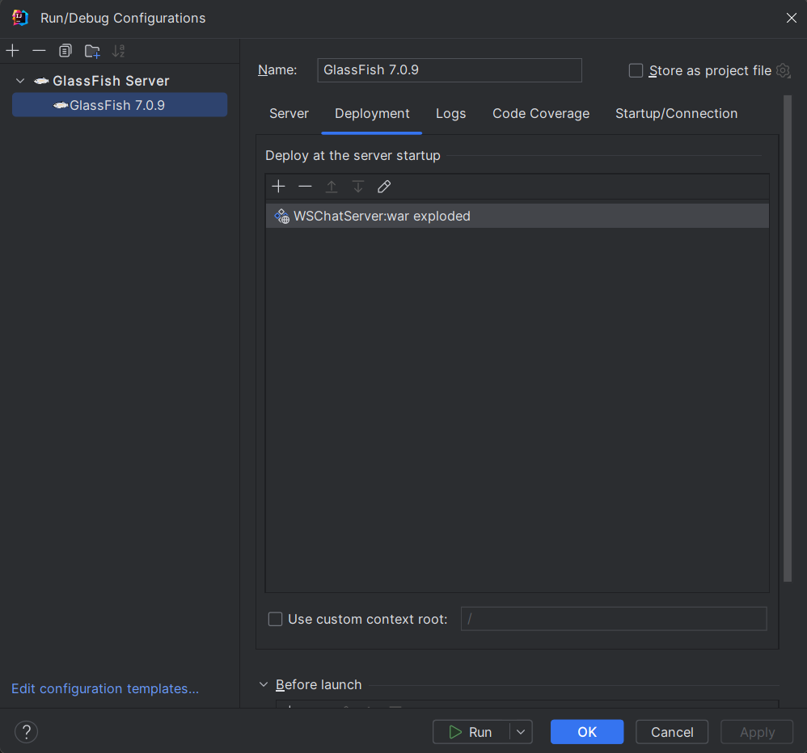
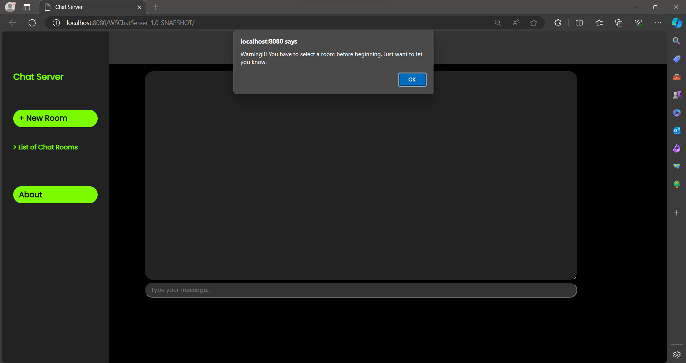
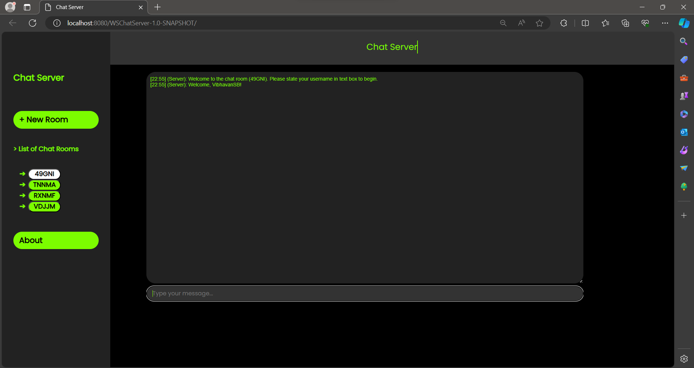

## Chat Server
___

  ## Project Overview

  This project is built to serve as a private messaging system among groups.
  This contains multiple chat rooms that will allow different groups to chat privately or in groups.

  

      This an image of how the program works  

  ## Web Chat Server Improvements

  For this Application, the following improvements were made:

  -  Users can send and receive messages to and from other users in real time without having to refresh the page.
  -  The server handles multiple chat rooms, allowing users to join different rooms with different users.
  -  Messages sent by users are broadcast to all connected users within the same chat room.

  ## Dependencies

  - Java Development Kit (JDK) 8 or higher
  - Jakarta WebSocket API

  ## Steps to Run the Chat Server
  - Clone the repository:\
    The easiest way to clone the entire project is to obtain the URL from GitHub and add a new project from version control using this URL (IntelliJ Feature). You can also clone the repository using Git Bash. For this, open Git Bash in your projects folder, then type the following:

  `git clone https://github.com/OntarioTech-CS-program/w24-csci2020u-assignment02-amin-tejpal-saibuvis-chowdhury.git`

  Once you clone the project, load the Maven settings when the prompt appears in IntelliJ.
  - Set up Glassfish Configuration:
      Select Current File near the top right of IntelliJ IDE. Press the `+` button and add a `GlassFish local server`. Ensure the fields (`URL` and `Server Domain`) in the Configurations pop-up match below:\
      
   
    Navigate to the `Deployment` tab, and choose the artifact to be deployed as seen below.
     

      
  Now you are all set to run the `GlassFish Server`.
  - After you run the server, the `WSChatServer` artifact is deployed which runs the `HTML` file in a browser (Microsoft Edge is recommended).\
    
      If you are not able to view the `HTML` file by default, just run the `index.html` file from IntelliJ when the server is running.
  - Next, you can create a new Chat Room and join it or join an existing Chat Room from the List of Chat Rooms on the left.  
  - Give yourself a username when prompted to do so and start chatting!
    

  - You can also visit the `About` page to learn more about the collaborators on this project.

  - You are more than welcome to contribute and customize this project. Fork the repository, make your changes, and submit a pull request if you want to contribute back to the project.
  ### Future Improvements

  - We can optimize the server performance to be able to handle larger volumes of concurrent users and messages.
  - Include features to allow users to share media like images, videos, or audio files with other users.
  - It is possible to add features to allow the user to personalize the interface appearance based on their preferences.
  - Integration with other social platforms and collaborative tools to increase productivity.
